# JAVA 基础

## java 反射

> [javase8 api docs](https://docs.oracle.com/javase/8/docs/api/) \
> [javase21 api docs](https://docs.oracle.com/en/java/javase/21/docs/api/index.html) \
> `java.lang.Class`

### 获取属性 `Field`

| 方法                                  | 描述                                   |
|:------------------------------------|:-------------------------------------| 
| Field	getField(String name)         | 获取名称为 name 的 **public** 属性对象         |
| Field[]    getFields()              | 获取全部 **public** 的属性对象                |
| Field	getDeclaredField(String name) | 获取名称为 name 的 **public和非public** 属性对象 |
| Field[]    getDeclaredFields()      | 获取全部 **public和非public** 的属性对象        |

### 获取方法 `Method`

| 方法                                                                | 描述                                                         |
|:------------------------------------------------------------------|:-----------------------------------------------------------| 
| Method	getMethod(String name, Class<?>... parameterTypes)         | 获取名称为 name,与参数类型parameterTypes匹配 的 **public** 方法对象         |
| Method[]    getMethods()                                          | 获取全部 **public** 方法对象                                       |
| Method	getDeclaredMethod(String name, Class<?>... parameterTypes) | 获取名称为 name,与参数类型parameterTypes匹配 的 **public和非public** 方法对象 |
| Method[]    getDeclaredMethods()                                  | 获取全部 **public和非public** 方法对象                               |

### 获取构造器 `Constructor<T>`

| 方法                                                                    | 描述                                                 |
|:----------------------------------------------------------------------|:---------------------------------------------------| 
| Constructor<T>    getConstructor(Class<?>... parameterTypes)          | 获取与参数类型parameterTypes匹配 的 **public** 构造器对象         |
| Constructor<?>[]    getConstructors()                                 | 获取全部 **public** 构造器对象                              |
| Constructor<T>    getDeclaredConstructor(Class<?>... parameterTypes)) | 获取与参数类型parameterTypes匹配 的 **public和非public** 构造器对象 |
| Constructor<?>[]    getDeclaredConstructors()                         | 获取全部 **public和非public** 构造器对象                      |

## java 注解

- 定义
    - 注解名称
    - 使用范围
    - 有效期
    - 是否可被继承
- 使用
    - 定义后在允许的地方使用标注即可
- **读取（注入灵魂）**
    - 只有获取到注解，才可以使用注解，注解才有用

### 元注解 java 提供 可以类比为元数据

- `@Documented` : java.lang.annotation.Documented 此注解会被javadoc工具提取成文档
- `@Retention` : java.lang.annotation.Retention 生效期
    - `java.lang.annotation.RetentionPolicy.SOURCE` : 编译期有效，如@Override 只做编译时的提示，不会写入字节码中
    - `java.lang.annotation.RetentionPolicy.CLASS` **default** : 类加载阶段有效 会保存到 字节码文件内，运行class文件被丢弃，大Class对象获取不到
    - `java.lang.annotation.RetentionPolicy.RUNTIME` : 运行时有效，只有运行时，代码才可以进行反射执行相关操作
- `@Target` : java.lang.annotation.Target 注解运行使用的位置
    - `java.lang.annotation.ElementType.TYPE` ：类，接口，注解，枚举 ;Class, interface (including annotation type), or enum
      declaration
    - `java.lang.annotation.ElementType.FIELD` ： 字段，枚举常量 ;Field declaration (includes enum constants)
    - `java.lang.annotation.ElementType.METHOD` : 方法 ;Method declaration
    - `java.lang.annotation.ElementType.PARAMETER` : 参数 ;Formal parameter declaration
    - `java.lang.annotation.ElementType.CONSTRUCTOR` ： 构造器 ;Constructor declaration
    - `java.lang.annotation.ElementType.LOCAL_VARIABLE` ： 局部变量 ;Local variable declaration
    - `java.lang.annotation.ElementType.ANNOTATION_TYPE` ： 注解 ;Annotation type declaration
    - `java.lang.annotation.ElementType.PACKAGE` ： 包 ;Package declaration
    - `java.lang.annotation.ElementType.TYPE_PARAMETER` jdk1.8新增 **类型参数**的声明语句中 ;Type parameter declaration
        - 如泛型 List<@tp T>
        - Predict<@tp T>
    - `java.lang.annotation.ElementType.TYPE_USE` jdk1.8新增 任何用到类型的地方 ;Use of a type
        - @typeuse Integer a;
        - @typeuse String str;
- `@Inherited` : 表示子类可以继承该类的注解

## 《改善Java程序的151个建议》

- [Chapter01](src/main/java/cn/aiclr/jvm/suggestions/book/java151/chapter01): Java开发中通用的方法和准则
  - [1. Aa](src/main/java/cn/aiclr/jvm/suggestions/book/java151/chapter01/Aa.java)不要在常量和变量中出现易混淆的字母
  - [2. Ab](src/main/java/cn/aiclr/jvm/suggestions/book/java151/chapter01/Ab.java)莫让常量蜕变成变量
  - [3. Ac](src/main/java/cn/aiclr/jvm/suggestions/book/java151/chapter01/Ac.java)三元操作符的类型务必一致
  - [4. Ad](src/main/java/cn/aiclr/jvm/suggestions/book/java151/chapter01/Ad.java)避免带有变长参数的方法重载
  - [5. Ae](src/main/java/cn/aiclr/jvm/suggestions/book/java151/chapter01/Ae.java)别让null值和空值威胁到变长方法
  - [6. Af](src/main/java/cn/aiclr/jvm/suggestions/book/java151/chapter01/Af.java)覆写变长方法也循规蹈矩
  - [7. Ag](src/main/java/cn/aiclr/jvm/suggestions/book/java151/chapter01/Ag.java)警惕自增的陷阱
  - [8. Ah](src/main/java/cn/aiclr/jvm/suggestions/book/java151/chapter01/Ah.java)不要让旧语法困扰你
  - [9. Ai](src/main/java/cn/aiclr/jvm/suggestions/book/java151/chapter01/Ai.java)少用静态导入
  - [10. Aj](src/main/java/cn/aiclr/jvm/suggestions/book/java151/chapter01/Aj.java)不要在本类中覆盖静态导入的变量和方法
  - [11. Ak](src/main/java/cn/aiclr/jvm/suggestions/book/java151/chapter01/Ak.java)养成良好习惯，显式声明UID
  - [12. Al](src/main/java/cn/aiclr/jvm/suggestions/book/java151/chapter01/Al.java)避免用序列化类在构造函数中为不变量赋值
  - [13. Am](src/main/java/cn/aiclr/jvm/suggestions/book/java151/chapter01/Am.java)避免为final变量复杂赋值
  - [14. An](src/main/java/cn/aiclr/jvm/suggestions/book/java151/chapter01/An.java)使用序列化类的私有方法巧妙解决部分属性持久化问题
  - [15. Ao](src/main/java/cn/aiclr/jvm/suggestions/book/java151/chapter01/Ao.java) break 万万不可忘
  - [16. Ap](src/main/java/cn/aiclr/jvm/suggestions/book/java151/chapter01/Ap.java)易变业务使用脚本语言编写
  - [17. Aq](src/main/java/cn/aiclr/jvm/suggestions/book/java151/chapter01/Aq.java)慎用***动态编译***
  - [18. Ar](src/main/java/cn/aiclr/jvm/suggestions/book/java151/chapter01/Ar.java)避免instanceof非预期结果
  - [19. As](src/main/java/cn/aiclr/jvm/suggestions/book/java151/chapter01/As.java)断言绝对不是鸡肋
  - [20. At](src/main/java/cn/aiclr/jvm/suggestions/book/java151/chapter01/At.java)不要只替换一个类
- [Chapter02](src/main/java/cn/aiclr/jvm/suggestions/book/java151/chapter02)：基本类型
  - [21. Au](src/main/java/cn/aiclr/jvm/suggestions/book/java151/chapter02/Au.java)用偶判断，不用奇判断
  - [22. Av](src/main/java/cn/aiclr/jvm/suggestions/book/java151/chapter02/Av.java)用整数类型处理货币
  - [23. Aw](src/main/java/cn/aiclr/jvm/suggestions/book/java151/chapter02/Aw.java)不要让类型默默转换
  - [24. Ax](src/main/java/cn/aiclr/jvm/suggestions/book/java151/chapter02/Ax.java)边界，边界，还是边界
  - [25. Ay](src/main/java/cn/aiclr/jvm/suggestions/book/java151/chapter02/Ay.java)不要让四舍五入亏了一方
  - [26. Az](src/main/java/cn/aiclr/jvm/suggestions/book/java151/chapter02/Az.java)提防包装类型的null值
  - [27. Ba](src/main/java/cn/aiclr/jvm/suggestions/book/java151/chapter02/Ba.java)谨慎包装类型的大小比较
  - [28. Bb](src/main/java/cn/aiclr/jvm/suggestions/book/java151/chapter02/Bb.java)优先使用整型池
  - [29. Bc](src/main/java/cn/aiclr/jvm/suggestions/book/java151/chapter02/Bc.java)优先选择基本类型
  - [30. Bd](src/main/java/cn/aiclr/jvm/suggestions/book/java151/chapter02/Bd.java)不要随便设置随机种子
- [Chapter03](src/main/java/cn/aiclr/jvm/suggestions/book/java151/chapter03)：对象及方法
  - [31. Be](src/main/java/cn/aiclr/jvm/suggestions/book/java151/chapter03/Be.java)在接口中不要存在实现代码
  - [32. Bf](src/main/java/cn/aiclr/jvm/suggestions/book/java151/chapter03/Bf.java)静态变量一定要先声明后赋值
  - [33. Bg](src/main/java/cn/aiclr/jvm/suggestions/book/java151/chapter03/Bg.java)不要覆写静态方法
  - [34. Bh](src/main/java/cn/aiclr/jvm/suggestions/book/java151/chapter03/Bh.java)构造函数尽量简化
  - [35. Bi](src/main/java/cn/aiclr/jvm/suggestions/book/java151/chapter03/Bi.java)避免在构造函数中初始化其他类
  - [36. Bj](src/main/java/cn/aiclr/jvm/suggestions/book/java151/chapter03/Bj.java)使用构造代码块精炼程序
  - [37. Bk](src/main/java/cn/aiclr/jvm/suggestions/book/java151/chapter03/Bk.java)构造代码块会想你所想
  - [38. Bl](src/main/java/cn/aiclr/jvm/suggestions/book/java151/chapter03/Bl.java)使用静态内部类提高封装性
  - [39. Bm](src/main/java/cn/aiclr/jvm/suggestions/book/java151/chapter03/Bm.java)使用匿名类的构造函数
  - [40. Bn](src/main/java/cn/aiclr/jvm/suggestions/book/java151/chapter03/Bn.java)匿名类的构造函数很特殊
  - [41. Bo](src/main/java/cn/aiclr/jvm/suggestions/book/java151/chapter03/Bo.java)让多重继承成为现实
  - [42. Bp](src/main/java/cn/aiclr/jvm/suggestions/book/java151/chapter03/Bp.java)让工具类不可实例化
  - [43. Bq](src/main/java/cn/aiclr/jvm/suggestions/book/java151/chapter03/Bq.java)避免对象的浅拷贝
  - [44. Br](src/main/java/cn/aiclr/jvm/suggestions/book/java151/chapter03/Br.java)推荐使用序列化实现对象的拷贝
  - [45. Bs](src/main/java/cn/aiclr/jvm/suggestions/book/java151/chapter03/Bs.java)覆写equals方法时不要识别不出自己
  - [46. Bt](src/main/java/cn/aiclr/jvm/suggestions/book/java151/chapter03/Bt.java) equals应该考虑null值情景
  - [47. Bu](src/main/java/cn/aiclr/jvm/suggestions/book/java151/chapter03/Bu.java)在equals中使用getClass进行类型判断
  - [48. Bv](src/main/java/cn/aiclr/jvm/suggestions/book/java151/chapter03/Bv.java)覆写equals方法必须覆写hashCode方法
  - [49. Bw](src/main/java/cn/aiclr/jvm/suggestions/book/java151/chapter03/Bw.java)推荐覆写toString方法
  - [50. Bx](src/main/java/cn/aiclr/jvm/suggestions/book/java151/chapter03/Bx.java)使用package-info类为包服务
  - [51. By](src/main/java/cn/aiclr/jvm/suggestions/book/java151/chapter03/By.java)不要主动进行垃圾回收
- [Chapter04](src/main/java/cn/aiclr/jvm/suggestions/book/java151/chapter04)：字符串
  - [52. Bz](src/main/java/cn/aiclr/jvm/suggestions/book/java151/chapter04/Bz.java)推荐使用String直接量赋值
  - [53. Ca](src/main/java/cn/aiclr/jvm/suggestions/book/java151/chapter04/Ca.java)注意方法中传递的参数要求
  - [54. Cb](src/main/java/cn/aiclr/jvm/suggestions/book/java151/chapter04/Cb.java)正确使用String、StringBuffer、StringBuilder
  - [55. Cc](src/main/java/cn/aiclr/jvm/suggestions/book/java151/chapter04/Cc.java)注意字符串的位置
  - [56. Cd](src/main/java/cn/aiclr/jvm/suggestions/book/java151/chapter04/Cd.java)自由选择字符串拼接方法
  - [57. Ce](src/main/java/cn/aiclr/jvm/suggestions/book/java151/chapter04/Ce.java)推荐在复杂字符串操作中使用正则表达式
  - [58. Cf](src/main/java/cn/aiclr/jvm/suggestions/book/java151/chapter04/Cf.java)强烈建议使用UTF编码
  - [59. Cg](src/main/java/cn/aiclr/jvm/suggestions/book/java151/chapter04/Cg.java)对字符串排序持一种宽容的心态
- [Chapter05](src/main/java/cn/aiclr/jvm/suggestions/book/java151/chapter05)：数组和集合
  - [60. Ch](src/main/java/cn/aiclr/jvm/suggestions/book/java151/chapter05/Ch.java)性能考虑，数组是首选
  - [61. Ci](src/main/java/cn/aiclr/jvm/suggestions/book/java151/chapter05/Ci.java)若有必要，使用变长数组
  - [62. Cj](src/main/java/cn/aiclr/jvm/suggestions/book/java151/chapter05/Cj.java)警惕数组的浅拷贝
  - [63. Ck](src/main/java/cn/aiclr/jvm/suggestions/book/java151/chapter05/Ck.java)在明确的场景下，为集合指定初始容量
  - [64. Cl](src/main/java/cn/aiclr/jvm/suggestions/book/java151/chapter05/Cl.java)多种最值算法，适时选择
  - [65. Cm](src/main/java/cn/aiclr/jvm/suggestions/book/java151/chapter05/Cm.java)避开基本类型数组转换列表陷阱
  - [66. Cn](src/main/java/cn/aiclr/jvm/suggestions/book/java151/chapter05/Cn.java) asList方法产生的List对象不可更改
  - [67. Co](src/main/java/cn/aiclr/jvm/suggestions/book/java151/chapter05/Co.java)不同的列表选择不同的遍历方法
  - [68. Cp](src/main/java/cn/aiclr/jvm/suggestions/book/java151/chapter05/Cp.java)频繁插入和删除时使用LinkedList
  - [69. Cq](src/main/java/cn/aiclr/jvm/suggestions/book/java151/chapter05/Cq.java)列表相等只需关心元素数据
  - [70. Cr](src/main/java/cn/aiclr/jvm/suggestions/book/java151/chapter05/Cr.java)子列表只是原列表的一个视图
  - [71. Cs](src/main/java/cn/aiclr/jvm/suggestions/book/java151/chapter05/Cs.java)推荐使用subList处理局部列表
  - [72. Ct](src/main/java/cn/aiclr/jvm/suggestions/book/java151/chapter05/Ct.java)生成子列表后不要再操作原列表
  - [73. Cu](src/main/java/cn/aiclr/jvm/suggestions/book/java151/chapter05/Cu.java)使用Comparator进行排序
  - [74. Cv](src/main/java/cn/aiclr/jvm/suggestions/book/java151/chapter05/Cv.java)不推荐使用binarySearch对列表进行检索
  - [75. Cw](src/main/java/cn/aiclr/jvm/suggestions/book/java151/chapter05/Cw.java)集合中的元素必须做到compareTo和equals同步
  - [76. Cx](src/main/java/cn/aiclr/jvm/suggestions/book/java151/chapter05/Cx.java)集合运算时使用更优雅的方式
  - [77. Cy](src/main/java/cn/aiclr/jvm/suggestions/book/java151/chapter05/Cy.java)使用shuffle打乱列表
  - [78. Cz](src/main/java/cn/aiclr/jvm/suggestions/book/java151/chapter05/Cz.java)减少HashMap中元素的数量
  - [79. Da](src/main/java/cn/aiclr/jvm/suggestions/book/java151/chapter05/Da.java)集合中的哈希码不要重复
  - [80. Db](src/main/java/cn/aiclr/jvm/suggestions/book/java151/chapter05/Db.java)多线程使用Vector或HashTable
  - [81. Dc](src/main/java/cn/aiclr/jvm/suggestions/book/java151/chapter05/Dc.java)非稳定排序推荐使用List
  - [82. Dd](src/main/java/cn/aiclr/jvm/suggestions/book/java151/chapter05/Dd.java)由点及面，一叶知秋—集合大家族
- [Chapter06](src/main/java/cn/aiclr/jvm/suggestions/book/java151/chapter06)：枚举和注解
  - [83. De](src/main/java/cn/aiclr/jvm/suggestions/book/java151/chapter06/De.java)推荐使用枚举定义常量
  - [84. Df](src/main/java/cn/aiclr/jvm/suggestions/book/java151/chapter06/Df.java)使用构造函数协助描述枚举项
  - [85. Dg](src/main/java/cn/aiclr/jvm/suggestions/book/java151/chapter06/Dg.java)小心switch带来的空值异常
  - [86. Dh](src/main/java/cn/aiclr/jvm/suggestions/book/java151/chapter06/Dh.java)在switch的default代码块中增加AssertionError错误
  - [87. Di](src/main/java/cn/aiclr/jvm/suggestions/book/java151/chapter06/Di.java)使用valueOf前必须进行校验
  - [88. Dj](src/main/java/cn/aiclr/jvm/suggestions/book/java151/chapter06/Dj.java)用枚举实现工厂方法模式更简洁
  - [89. Dk](src/main/java/cn/aiclr/jvm/suggestions/book/java151/chapter06/Dk.java)枚举项的数量限制在64个以内
  - [90. Dl](src/main/java/cn/aiclr/jvm/suggestions/book/java151/chapter06/Dl.java)小心注解继承
  - [91. Dm](src/main/java/cn/aiclr/jvm/suggestions/book/java151/chapter06/Dm.java)枚举和注解结合使用威力更大
  - [92. Dn](src/main/java/cn/aiclr/jvm/suggestions/book/java151/chapter06/Dn.java)注意@Override不同版本的区别
- [Chapter07](src/main/java/cn/aiclr/jvm/suggestions/book/java151/chapter07)：泛型和反射
  - [93. Do](src/main/java/cn/aiclr/jvm/suggestions/book/java151/chapter07/Do.java) Java的泛型是类型擦除的
  - [94. Dp](src/main/java/cn/aiclr/jvm/suggestions/book/java151/chapter07/Dp.java)不能初始化泛型参数和数组
  - [95. Dq](src/main/java/cn/aiclr/jvm/suggestions/book/java151/chapter07/Dq.java)强制声明泛型的实际类型
  - [96. Dr](src/main/java/cn/aiclr/jvm/suggestions/book/java151/chapter07/Dr.java)不同的场景使用不同的泛型通配符
  - [97. Ds](src/main/java/cn/aiclr/jvm/suggestions/book/java151/chapter07/Ds.java)警惕泛型是不能协变和逆变的
  - [98. Dt](src/main/java/cn/aiclr/jvm/suggestions/book/java151/chapter07/Dt.java)建议采用的顺序是List<T>、List<?>、List<Object>
  - [99. Du](src/main/java/cn/aiclr/jvm/suggestions/book/java151/chapter07/Du.java)严格限定泛型类型采用多重界限
  - [100. Dv](src/main/java/cn/aiclr/jvm/suggestions/book/java151/chapter07/Dv.java)数组的真实类型必须是泛型类型的子类型
  - [101. Dw](src/main/java/cn/aiclr/jvm/suggestions/book/java151/chapter07/Dw.java)注意Class类的特殊性
  - [102. Dx](src/main/java/cn/aiclr/jvm/suggestions/book/java151/chapter07/Dx.java)适时选择getDeclared×××和get×××
  - [103. Dy](src/main/java/cn/aiclr/jvm/suggestions/book/java151/chapter07/Dy.java)反射访问属性或方法时将Accessible设置为true
  - [104. Dz](src/main/java/cn/aiclr/jvm/suggestions/book/java151/chapter07/Dz.java)使用forName动态加载类文件
  - [105. Ea](src/main/java/cn/aiclr/jvm/suggestions/book/java151/chapter07/Ea.java)动态加载不适合数组
  - [106. Eb](src/main/java/cn/aiclr/jvm/suggestions/book/java151/chapter07/Eb.java)动态代理可以使代理模式更加灵活
  - [107. Ec](src/main/java/cn/aiclr/jvm/suggestions/book/java151/chapter07/Ec.java)使用反射增加装饰模式的普适性
  - [108. Ed](src/main/java/cn/aiclr/jvm/suggestions/book/java151/chapter07/Ed.java)反射让模板方法模式更强大
  - [109. Ee](src/main/java/cn/aiclr/jvm/suggestions/book/java151/chapter07/Ee.java)不需要太多关注反射效率
- [Chapter08](src/main/java/cn/aiclr/jvm/suggestions/book/java151/chapter08)：异常
  - [110. Ef](src/main/java/cn/aiclr/jvm/suggestions/book/java151/chapter08/Ef.java)提倡异常封装
  - [111. Eg](src/main/java/cn/aiclr/jvm/suggestions/book/java151/chapter08/Eg.java)采用异常链传递异常
  - [112. Eh](src/main/java/cn/aiclr/jvm/suggestions/book/java151/chapter08/Eh.java)受检异常尽可能转化为非受检异常
  - [113. Ei](src/main/java/cn/aiclr/jvm/suggestions/book/java151/chapter08/Ei.java)不要在finally块中处理返回值
  - [114. Ej](src/main/java/cn/aiclr/jvm/suggestions/book/java151/chapter08/Ej.java)不要在构造函数中抛出异常
  - [115. Ek](src/main/java/cn/aiclr/jvm/suggestions/book/java151/chapter08/Ek.java)使用Throwable获得栈信息
  - [116. El](src/main/java/cn/aiclr/jvm/suggestions/book/java151/chapter08/El.java)异常只为异常服务
  - [117. Em](src/main/java/cn/aiclr/jvm/suggestions/book/java151/chapter08/Em.java)多使用异常，把性能问题放一边
- [Chapter09](src/main/java/cn/aiclr/jvm/suggestions/book/java151/chapter09)：多线程和并发
  - [118. En](src/main/java/cn/aiclr/jvm/suggestions/book/java151/chapter09/En.java)不推荐覆写start方法
  - [119. Eo](src/main/java/cn/aiclr/jvm/suggestions/book/java151/chapter09/Eo.java)启动线程前stop方法是不可靠的
  - [120. Ep](src/main/java/cn/aiclr/jvm/suggestions/book/java151/chapter09/Ep.java)不使用stop方法停止线程
  - [121. Eq](src/main/java/cn/aiclr/jvm/suggestions/book/java151/chapter09/Eq.java)线程优先级只使用三个等级
  - [122. Er](src/main/java/cn/aiclr/jvm/suggestions/book/java151/chapter09/Er.java)使用线程异常处理器提升系统可靠性
  - [123. Es](src/main/java/cn/aiclr/jvm/suggestions/book/java151/chapter09/Es.java) volatile不能保证数据同步
  - [124. Et](src/main/java/cn/aiclr/jvm/suggestions/book/java151/chapter09/Et.java)异步运算考虑使用Callable接口
  - [125. Eu](src/main/java/cn/aiclr/jvm/suggestions/book/java151/chapter09/Eu.java)优先选择线程池
  - [126. Ev](src/main/java/cn/aiclr/jvm/suggestions/book/java151/chapter09/Ev.java)适时选择不同的线程池来实现
  - [127. Ew](src/main/java/cn/aiclr/jvm/suggestions/book/java151/chapter09/Ew.java)Lock与synchronized是不一样的
  - [128. Ex](src/main/java/cn/aiclr/jvm/suggestions/book/java151/chapter09/Ex.java)预防线程死锁
  - [129. Ey](src/main/java/cn/aiclr/jvm/suggestions/book/java151/chapter09/Ey.java)适当设置阻塞队列长度
  - [130. Ez](src/main/java/cn/aiclr/jvm/suggestions/book/java151/chapter09/Ez.java)使用CountDownLatch协调子线程
  - [131. Fa](src/main/java/cn/aiclr/jvm/suggestions/book/java151/chapter09/Fa.java) CyclicBarrier让多线程齐步走
- [Chapter10](src/main/java/cn/aiclr/jvm/suggestions/book/java151/chapter10)：性能和效率
  - [132. Fb](src/main/java/cn/aiclr/jvm/suggestions/book/java151/chapter10/Fb.java)提升Java性能的基本方法
  - [133. Fc](src/main/java/cn/aiclr/jvm/suggestions/book/java151/chapter10/Fc.java)若非必要，不要克隆对象
  - [134. Fd](src/main/java/cn/aiclr/jvm/suggestions/book/java151/chapter10/Fd.java)推荐使用“望闻问切”的方式诊断性能
  - [135. Ff](src/main/java/cn/aiclr/jvm/suggestions/book/java151/chapter10/Ff.java)必须定义性能衡量标准
  - [136. Fg](src/main/java/cn/aiclr/jvm/suggestions/book/java151/chapter10/Fg.java)枪打出头鸟—解决首要系统性能问题
  - [137. Fh](src/main/java/cn/aiclr/jvm/suggestions/book/java151/chapter10/Fh.java)调整JVM参数以提升性能
  - [138. Fi](src/main/java/cn/aiclr/jvm/suggestions/book/java151/chapter10/Fi.java)性能是个大“咕咚”
- [Chapter11](src/main/java/cn/aiclr/jvm/suggestions/book/java151/chapter11)：开源世界
  - [139. Fj](src/main/java/cn/aiclr/jvm/suggestions/book/java151/chapter11/Fj.java)大胆采用开源工具
  - [140. Fk](src/main/java/cn/aiclr/jvm/suggestions/book/java151/chapter11/Fk.java)推荐使用Guava扩展工具包
  - [141. Fl](src/main/java/cn/aiclr/jvm/suggestions/book/java151/chapter11/Fl.java) Apache扩展包
  - [142. Fm](src/main/java/cn/aiclr/jvm/suggestions/book/java151/chapter11/Fm.java)推荐使用Joda日期时间扩展包
  - [143. Fn](src/main/java/cn/aiclr/jvm/suggestions/book/java151/chapter11/Fn.java)可以选择多种Collections扩展
- [Chapter12](src/main/java/cn/aiclr/jvm/suggestions/book/java151/chapter12)：思想为源
  - [144. Fo](src/main/java/cn/aiclr/jvm/suggestions/book/java151/chapter12/Fo.java)提倡良好的代码风格
  - [145. Fp](src/main/java/cn/aiclr/jvm/suggestions/book/java151/chapter12/Fp.java)不要完全依靠单元测试来发现问题
  - [146. Fq](src/main/java/cn/aiclr/jvm/suggestions/book/java151/chapter12/Fq.java)让注释正确、清晰、简洁
  - [147. Fr](src/main/java/cn/aiclr/jvm/suggestions/book/java151/chapter12/Fr.java)让接口的职责保持单一
  - [148. Fs](src/main/java/cn/aiclr/jvm/suggestions/book/java151/chapter12/Fs.java)增强类的可替换性
  - [149. Ft](src/main/java/cn/aiclr/jvm/suggestions/book/java151/chapter12/Ft.java)依赖抽象而不是实现
  - [150. Fu](src/main/java/cn/aiclr/jvm/suggestions/book/java151/chapter12/Fu.java)抛弃7条不良的编码习惯
  - [151. Fv](src/main/java/cn/aiclr/jvm/suggestions/book/java151/chapter12/Fv.java)以技术员自律而不是工人

## 《改善Java程序的151个建议》笔记

1. 包名全小写、类名首字母全大写、常量全部大写并用下划线分隔、变量采用驼峰命名法（Camel Case）;
2. 不要将易混字母混合使用`iIlL10Oo`(小写字母i、大写字母I、小写字母l、大写字母L、数字1、数字0、大写字母O、小写字母o)
3. 在面向对象编程（Object-Oriented Programming，OOP）的世界里，类和对象是真实世界的描述工具，方法是行为和动作的展示形式，封装、继承、多态则是其多姿多彩的主要实现方式
4. 枚举和注解都是在 Java 1.5 中引入的。枚举改变了常量的声明方式;注解耦合了数据和代码.
5. Java 从1.5版开始引入了注解（Annotation），其目的是在不影响代码语义的情况下增强代码的可读性，并且不改变代码的执行逻辑，对于注解始终有两派争论，正方认为注解有益于数据与代码的耦合，“在有代码的周边集合数据”；反方认为注解把代码和数据混淆在一起，增加了代码的易变性，削弱了程序的健壮性和稳定性
6. 泛型可以减少强制类型的转换，可以规范集合的元素类型，还可以提高代码的安全性和可读性，正是因为有这些优点，自从 Java 引入泛型后，项目的编码规则上便多了一条：优先使用泛型
7. 反射可以“看透”程序的运行情况，可以让我们在运行期知晓一个类或实例的运行状况，可以动态地加载和调用，虽然有一定的性能忧患，但它带给我们的便利远远大于其性能缺陷





## 枚举

```text
枚举的每一项，都相当于是枚举类的子类
```

## 建议使用 UTF 编码

### java 文件编码

```text
使用记事本创建 .java 后缀的文件，则文件的编码格式就是操作系统默认的格式。
如果是使用 IDE 工具创建的，则依赖于 IDE 的设置
```

### class 文件编码

```text
通过 javac 命令生成的 .class 字节码文件是 UTF-8 编码的 UNICODE 文件,与操作系统无关
UTF 是 UNICODE 的存储和传输格式，是为了解决 UNICODE 的高位占用冗余空间而产生的
使用 UTF 编码就标志着字符集使用的是 UNICODE
```

### javac

- 不指定 encoding 默认使用系统的编码，windows=GBK，java 文件编码格式最好与 encoding 指定的一致，否则 class 文件里的中文是乱码

```shell script
javac -encoding GBK GBKCode.java
```

### javap

- 阅读 class 文件，也可以借助 IDEA 菜单 view/Show Bytecode 阅读

```shell script
javap GBKCode
```
